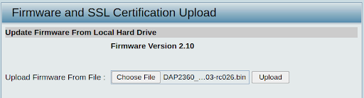
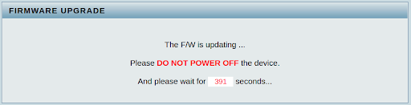
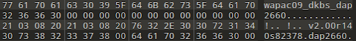
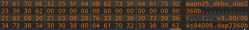
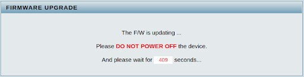

# Several vulnerabilities regarding firmware updates in multiple D-Link devices.

## Affected products
We have not yet tested DAP-series access points other than those listed. However, we suspect it may also work on other models with similar firmware versions.

- DAP-2310 (B): 2.10rc036 and earlier
- DAP-2330 (A): 1.06rc020 and earlier
- DAP-2360 (B): 2.10rc050 and earlier
- DAP-2553 (B): 3.10rc031 and earlier
- DAP-2660 (A): 1.15rc093 and earlier
- DAP-2690 (B): 3.20rc106 and earlier
- DAP-2695 (A): 1.20rc119_beta31 and earlier
- DAP-3320 (A): 1.05rc027 beta and earlier
- DAP-3662 (A): 1.05rc047 and earlier


## Vulnerability #1 - Firmware downgrade attack
### Overview: 
An issue was discovered on the devices mentioned above. An attacker can upload a firmware image older than the current version. Once the firmware image is written into the flash memory, a firmware downgrade attack is launched successfully, resulting in more vulnerabilities introduced by the older firmware image.

### Details:
Take DAP-2360 v2.10 as an example. After running the firmware and accessing the firmware update webpage, we can choose the DAP-2360 v2.03 to upload. 



After uploading the firmware, the older firmware image successfully passes the firmware verification. Then, the device enters firmware upgrade mode and stops all services.



The backend logs are listed below. From the logs, we can see that after older firmware is uploaded, all services are shut down, and the device reboots.

```
[/etc/scripts/misc/preupgrade.sh] ...
PREUPGRADE
[/usr/sbin/submit] COMMIT ...
[/etc/scripts/misc/profile.sh] put ...
+++++++++++++++++++++++++++++++++++++++++++++++++++++++++++
+                                                         +
+                  Devconf write_data!!                   +
+                                                         +
+++++++++++++++++++++++++++++++++++++++++++++++++++++++++++
ok
[/etc/templates/upnpd.sh] ...
[/var/run/upnpd_stop.sh] ...
Stopping UPNPD ...
[/etc/scripts/misc/haltdemand.sh] ...
[/etc/templates/wlan.sh] ...
SERVD: stop service [WLAN]
[/etc/templates/wlan_run.sh] stop ...
[/usr/sbin/submit] QOS_TC_TM_STOP ...
[/var/run/tc_monitor_stop.sh] ...
tc monitor already stop
[  746.816000] firmadyne: ioctl: 0x3
[/var/run/trafficmgr_stop.sh] ...
[/var/run/qos_stop.sh] ...
[/var/run/autorekey_stop.sh] ...
Killed
[/var/run/vlan_stop.sh] ...
[/var/run/multi_ssid_stop_g.sh] ...
[/var/run/wlan_stop.sh] ...
Stop WLAN interface …

…

[/etc/templates/wan.sh] stop ...
[/var/run/wan_stop.sh] ...
Bridge mode selected !
>>>/var/run/wan_stop.sh: Start IPv6 configuration >>>
Flush IPv6 runtime...
<<< End of IPv6 <<<
[/etc/templates/upnpd.sh] ...
[/etc/templates/lan.sh] ...
[/var/run/lan_stop.sh] ...
Bridge mode selected, LAN is disabled !
[/etc/templates/webs.sh] stop ...
[/var/run/webs_stop.sh] ...
Stopping HTTPD ...
[/etc/templates/neapc.sh] stop ...
[/var/run/neapc_stop.sh] ...
Stop NeapC Client ...
Stop apneaps Server ...
[/etc/templates/neaps.sh] stop ...
[/var/run/neaps_stop.sh] ...
Stop Neap Server ...
[  807.112000] firmadyne: ioctl: 0x3
[/etc/templates/loadbalance.sh] stop ...
[/var/run/loadbalance_stop.sh] ...
Stop loadbalance ...
[/etc/templates/autorf.sh] stop ...
Stop autorf client ...
[/etc/templates/apneaps_v2.sh] stop ...
Stop apneaps_v2 Server ...
Start kill some process...
End kill some process...
Done ! Start burning ...
```

## Vulnerability #2 - DoS attack
### Overview: 
An issue was discovered on the devices mentioned above. An attacker can upload a mismatched firmware after modifying the firmware header. The device will accept the modified mismatched firmware, resulting in DoS. 

### Details:
Again, take DAP-2360 v2.10 as an example. We select another mismatched firmware of DAP-2660 v2.00 and modify the firmware header to the same firmware header as DAP-2360 v3.00.





After uploading the firmware, the modified mismatched firmware image successfully passes the firmware verification. Then, the device enters firmware upgrade mode and stops all services.



The backend logs are listed below. From the logs, we can see that after the modified mismatched firmware image is uploaded, all services are shut down, and the device reboots, which makes the device DoS.

```
[/etc/scripts/misc/preupgrade.sh] ...
PREUPGRADE
[/usr/sbin/submit] COMMIT ...
[/etc/scripts/misc/profile.sh] put ...
+++++++++++++++++++++++++++++++++++++++++++++++++++++++++++
+                                                         +
+                  Devconf write_data!!                   +
+                                                         +
+++++++++++++++++++++++++++++++++++++++++++++++++++++++++++
ok
[/etc/templates/upnpd.sh] ...
[/var/run/upnpd_stop.sh] ...
Stopping UPNPD ...
[/etc/scripts/misc/haltdemand.sh] ...
[/etc/templates/wlan.sh] ...
SERVD: stop service [WLAN]
[/etc/templates/wlan_run.sh] stop ...
[/usr/sbin/submit] QOS_TC_TM_STOP ...
[/var/run/tc_monitor_stop.sh] ...
tc monitor already stop
[/var/run/trafficmgr_stop.sh] ...
[/var/run/qos_stop.sh] ...
[/var/run/autorekey_stop.sh] ...
Killed
[/var/run/vlan_stop.sh] ...
[/var/run/multi_ssid_stop_g.sh] ...
[/var/run/wlan_stop.sh] ...
Stop WLAN interface ...

…

[/etc/templates/wan.sh] stop ...
[/var/run/wan_stop.sh] ...
Bridge mode selected !
>>>/var/run/wan_stop.sh: Start IPv6 configuration >>>
Flush IPv6 runtime...
<<< End of IPv6 <<<
[/etc/templates/upnpd.sh] ...
[/etc/templates/lan.sh] ...
[/var/run/lan_stop.sh] ...
Bridge mode selected, LAN is disabled !
[/etc/templates/webs.sh] stop ...
[/var/run/webs_stop.sh] ...
Stopping HTTPD ...
[/etc/templates/neapc.sh] stop ...
[  150.936000] firmadyne: ioctl: 0x3
[/var/run/neapc_stop.sh] ...
Stop NeapC Client ...
Stop apneaps Server ...
[/etc/templates/neaps.sh] stop ...
[/var/run/neaps_stop.sh] ...
Stop Neap Server ...
[/etc/templates/loadbalance.sh] stop ...
[/var/run/loadbalance_stop.sh] ...
Stop loadbalance ...
[/etc/templates/autorf.sh] stop ...
Stop autorf client ...
[/etc/templates/apneaps_v2.sh] stop ...
Stop apneaps_v2 Server ...
Start kill some process...
End kill some process...
Done ! Start burning ...
```

## Vulnerability #3 - Insecure communication
### Overview: 
An issue was discovered on the devices mentioned above. The firmware upload is performed via the HTTP protocol, which does not provide any cryptographic protection of the uploaded contents. An attacker with a privileged network position (which could be obtained via ARP spoofing, DNS spoofing, or other approaches) can exploit this issue in order to provide arbitrary malicious firmware updates. When being exploited in a combination of the above vulnerabilities, the device can be compromised. 
